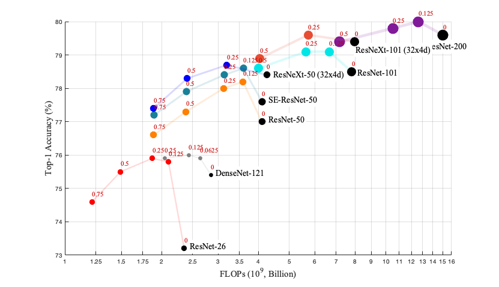

# Octave Convolution
MXNet implementation for:

[Drop an Octave: Reducing Spatial Redundancy in Convolutional Neural Networks with Octave Convolution](https://arxiv.org/abs/1904.05049)

Note:
- This repo is under development.


## To Do List
- [x] [Code for ablation study (by Symbol API)](utils/symbol)
- [ ] Code for the rest exps (by Gluon API)
- [ ] Training script
- [ ] Training logs
- [ ] Trained models


## ImageNet

### Ablation
- Loss: Softmax
- Learning rate: Cosine (warm-up: 5 epochs, lr: 0.4)
- MXNet API: [Symbol API](https://mxnet.incubator.apache.org/api/python/symbol.html)



Note:
- All residual networks in ablation study adopt pre-actice version[1] for convenience.


### Others
- Learning rate: Cosine (warm-up: 5 epochs, lr: 0.4)
- MXNet API: [Gluon API](https://mxnet.incubator.apache.org/api/python/gluon/nn.html)

|         Model        | alpha | label smoothing[2] | mixup[3] |#Params | #FLOPs |  Top1 |
|:--------------------:|:-----:|:------------------:|:--------:|:------:|:------:|:-----:|
| 0.75  MobileNet (v1) |  .375 |                    |          |  2.6 M |  213 M |  70.6 |
| 1.0   MobileNet (v1) |  .5   |                    |          |  4.2 M |  321 M |  72.4 |
| 1.0   MobileNet (v2) |  .375 |         Yes        |          |  3.5 M |  213 M |  72.0 |
| 1.125 MobileNet (v2) |  .5   |         Yes        |          |  4.2 M |  321 M |  73.0 |
| Oct-ResNet-152       |  .125 |         Yes        |    Yes   | 60.2 M | 10.9 G |  81.4 |
| Oct-ResNet-152 + SE  |  .125 |         Yes        |    Yes   | 66.8 M | 10.9 G |  81.6 |


## Citation
```
@article{chen2019drop,
  title={Drop an Octave: Reducing Spatial Redundancy in Convolutional Neural Networks with Octave Convolution},
  author={Chen, Yunpeng and Fan, Haoqi and Xu, Bing and Yan, Zhicheng and Kalantidis, Yannis and Rohrbach, Marcus and Yan, Shuicheng and Feng, Jiashi},
  journal={arXiv preprint arXiv:1904.05049},
  year={2019}
}
```


## Third-party Implementations

- [MXNet Implementation](https://github.com/terrychenism/OctaveConv) **with imagenet training log** by [terrychenism](https://github.com/terrychenism)
- [Keras Implementation](https://github.com/koshian2/OctConv-TFKeras) **with cifar10 results** by [koshian2](https://github.com/koshian2)


## Acknowledgement
- Thanks [MXNet](https://mxnet.incubator.apache.org/), [Gluon-CV](https://gluon-cv.mxnet.io/) and [TVM](https://tvm.ai/)!
- Thanks [@Ldpe2G](https://github.com/Ldpe2G) for sharing the code for calculating the #FLOPs \([`link`](https://github.com/Ldpe2G/DeepLearningForFun/tree/master/Mxnet-Scala/UsefulTools)\)
- Thanks Min Lin (Mila), Xin Zhao (Qihoo Inc.), Tao Wang (NUS) for helpful discussions on the code development.


## Reference
[1] He K, et al "Identity Mappings in Deep Residual Networks".

[2] Christian S, et al "Rethinking the Inception Architecture for Computer Vision"

[3] Zhang H, et al. "mixup: Beyond empirical risk minimization.".

## License
The code and the models are MIT licensed, as found in the LICENSE file.
